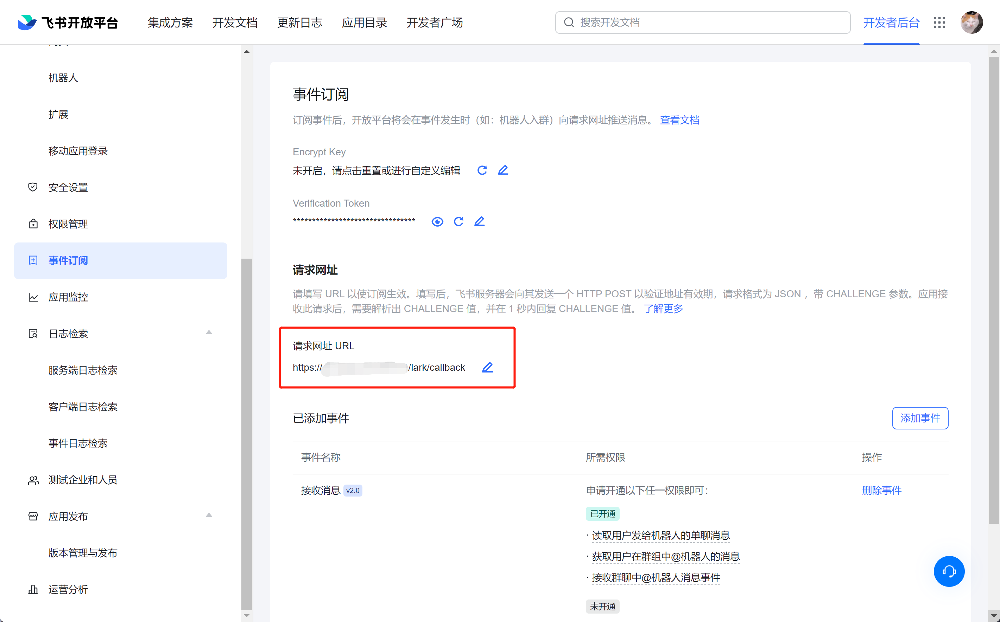

## 飞书/Lark 机器人开发框架 for NestJS

### 安装

在 NestJS 项目下执行以下命令安装：

```shell
npm install -g nestjs-lark-bot
```
### 使用

在需要调用飞书业务的 Module 中声明一个类继承于 LarkBotService（注意：不要加 `@Injectable()` ）

```typescript
import {Logger} from '@nestjs/common'
import {BotEventDto, LarkBotService} from 'nestjs-lark-bot'

export class BotService extends LarkBotService {
  async onMessage(message: BotEventDto): Promise<void> {
    Logger.log(JSON.stringify(message))
  }
}
```

于该业务的 `.module.ts` 中引入:

```typescript
@Module({
  imports: [
    LarkBotModule.register(BotService, {
      debug: true, // 可选，默认 false
      appId: 'foo',
      appSecret: 'bar',
      appVerificationToken: 'baz', // 暂未支持
      endpoint: Domain.FeiShu, // 可选，默认飞书
    })
  ],
  ...
})
```

也可通过注入 `ConfigModule` 从环境变量/配置文件中获取配置，如：

```typescript
@Module({
  imports: [
    LarkBotModule.registerFactory(BotService, {
      imports: [ConfigModule],
      inject: [ConfigService],
      useFactory: (configService: ConfigService) => ({
        appId: configService.get('LARK_APP_ID', 'foooo'),
        appSecret: configService.get('LARK_APP_SECRET', 'bar'),
      }),
    }),
  ],
  ...
})
```

`LarkBotService` 提供了一些基础方法，如 `getTenantAccessToken()`, `getUserById()` 等。其他需要功能且未实现的 api，请参考 源码中的`LarkBotService.ts` 调用 `apiRequest<T>()` 方法实现。

### 部署

部署 NestJS 项目到公网服务器（略）；

在飞书开放平台的应用管理中，事件订阅中设置请求网址为项目的公网地址，并添加"接收消息 v2.0事件"。



用户发送到机器人的消息会由 `LarkBotService` 实现类中的 `onMessage` 方法处理，可以在 `onMessage` 中调用 `apiRequest<T>()` 方法调用飞书业务接口。
